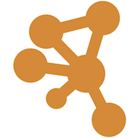
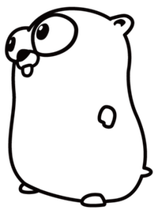

# Cytoscape CI Service Sample Implementation for Go Developers

 


## Introduction
This is a sample CI service implementation written in Go.  In this project, we use a simple ID mapping service as an example.


## Basic Design
_Any_ type of RESTful API server can work as a part of Cytoscape CI system.  This means if you have existing API server, 
the change required to use as a CI service is very small.

The followings are the building blocks of your CI service:

### 1. Actual Service Package

For all types of services, it is a good idea to create a single-function, command-line tool first.  You can start with 
 designing your function by defining the following:

* Function - What is the function of your service?
* Input - What are the parameters you need to pass for the tool?
* Output - What is the output data user get?


In this example, the goal is simple and clear:

* Function: For given list of gene IDs, generate mappings to other set of IDs.  e.g., Entrez Gene ID to Ensemble ID
* Input: List of IDs
* Output: List of maps from input ID to other set of IDs.

Once you decide, implement such function.  This portion of your code should work with or without RESTful server.


### 2. RESTful API Server
Once your function works, wrap it with an API server code.  In Go, there are some nice and thin frameworks for implementing 
RESTful API, like [Gin](https://gin-gonic.github.io/gin/).  You can choose any of those to do this job.  In this example, we simply use standard _net/http_ 
package to implement API server.

The requirement for this part is writing an API to consume and generate JSON. 


### 3. Registration to _Submit Agent_
When you finish writing the REST API server, now you are ready to register it to task submit agent for CI.  
Currently, we have an [Erlang](http://www.erlang.org/) implementation of Submit Agent called 
[elsa](https://github.com/cytoscape-ci/elsa).  To register your service, you can POST some required information 
to the agent.

In this example, there is a reusable module to do this task and you can use it if you just want to register single 
server.


# Sample Service Implementation

## ID Mapping Service

As a sample service for Go developers, this repository contains complete code for simple ID Mapping service, 
which loads all mapping data into memory and return result in JSON.

Currently, the original data sources are [NCBI Gene](ftp://ftp.ncbi.nih.gov/gene/DATA/GENE_INFO/) and 
[UniprotKB](ftp://ftp.uniprot.org/pub/databases/uniprot/current_release/knowledgebase/idmapping/by_organism/).


## How to Run

### 1. In single API server mode
You can run this service as a single RESTful API server independent from Cytoscape CI.

#### On your local machine

* Requirments
  * Go 1.5.x and later
  * Python 3.5.x or newer
    * pandas

* Clone this repository
* ```cd data```
* Run this command to download and create mapping tables from NCBI and Uniprot:  ```python ./data_table_generator.py```
* ```cd ..```
* ```go build app.go```
* ```./app```

Then access ```http://localhost:3000/``` to check the server is actually working or not.


#### Docker Container
The easiest way to run this application is using Docker.  Suppose you are using Docker host running on ```192.168.99.100```.

Make sure you have _docker-compose_ installed.
 
```bash
docker-compose build
docker-compose up 
```

Then access ```http://192.168.99.100:3000/map```.  You will see the following message:

```json
{
    "code": 405,
    "message": "You need to POST your data to use this service.",
    "error": "Invalid HTTP method used: GET"
}
```

(Since you need to _POST_ your data to use this service, you see this error message.)

To test, try the following command:

```bash
curl -H "Accept: application/json" -H "Content-type: application/json" -X \
    POST -d '{"ids": ["P53_HUMAN", "TP53", "P04637", "7157fdsfds"]}' \
    http://192.168.99.100:3000/map | jq .
```

(All in one line.)


### Register to _elsa_
(TBD)


### Query

```json
{
    "ids": ["id1", "id2", ... ]
}
```

#### _ids_
A list of IDs as text.  You can mix multiple ID types, and multiple species in a query.  Matching is __NOT case sensitive__.

##### Supported input ID types

* Entrez Gene ID
* UniProtKB-AC
* UniProtKB-ID
* Ensembl Gene ID
* Locus Tag
* Gene Symbol

##### Supported Species (more coming soon...)

* Human (Homo sapiens: 9606)
* Yeast (Saccharomyces cerevisiae: 4932)
* Fly (Drosophila melanogaster: 7227)
* Mouse (Mus musculus: 10090)


#### _filter_
(TODO)


### Result

#### Sample

* Input:

```json
{
    "ids": ["Antp", "HOXA7"] 
}
```

* Output:

```json
{
    "matched": [
        {
            "inType": "Symbol",
            "in": "Antp",
            "matches": {
                "UniRef90": "UniRef90_P02833-2",
                "chromosome": "3R",
                "description": "Antennapedia",
                "EMBL": [
                    "AE014297",
                    "AE014297"
                ],
                "UniRef50": "UniRef50_P02833",
                "GeneID": "40835",
                "map_location": "84A6-84B2|3-47.5 cM",
                "UniRef100": "UniRef100_Q7KSY7",
                "Full_name_from_nomenclature_authority": "Antennapedia",
                "RefSeq": [
                    "NP_996166.1",
                    "NP_996173.1"
                ],
                "Synonyms": "3.4|ANT-C|ANT-P|ANTC|ANTP|Ant|AntP|AntP1|Antp P1|Antp P2|Antp1|Aus|BG:DS07700.1|CG1028|DMANTPE1|DRO15DC96Z|DmAntp|Dmel\\CG1028|Hu|Ns|Scx|antp|l(3)84Ba",
                "EMBL-CDS": [
                    "AAS65105.1",
                    "AAS65106.1"
                ],
                "LocusTag": "Dmel_CG1028",
                "PDB": "2HOA:A",
                "GI": [
                    "45446385",
                    "45553293",
                    "45446386",
                    "45553279",
                    "159164638"
                ],
                "UniProtKB-AC": "Q7KSY7",
                "UniGene": "Dm.3803",
                "UniParc": "UPI000034DF86",
                "UniProtKB-ID": "Q7KSY7_DROME",
                "GO": [
                    "GO:0005634",
                    "GO:0043565",
                    "GO:0003700",
                    "GO:0007275"
                ]
            },
            "species": "fly"
        },
        {
            "inType": "Symbol",
            "in": "HOXA7",
            "matches": {
                "UniRef90": "UniRef90_P31268",
                "description": "homeobox A7",
                "EMBL": [
                    "AF026397",
                    "AJ005814",
                    "AF032095",
                    "X84803",
                    "X84804",
                    "CH236948",
                    "AC004080",
                    "CH471073",
                    "U92543"
                ],
                "Ensembl": "ENSG00000122592",
                "Full_name_from_nomenclature_authority": "homeobox A7",
                "RefSeq": "NP_008827.2",
                "EMBL-CDS": [
                    "AAB94604.1",
                    "CAA06713.1",
                    "AAD01939.2",
                    "CAA59270.1",
                    "CAA59270.1",
                    "EAL24221.1",
                    "EAW93877.1",
                    "AAD00727.1"
                ],
                "Ensembl_TRS": "ENST00000242159",
                "MIM": "142950",
                "GI": [
                    "2739071",
                    "24497556",
                    "51094977",
                    "6918885",
                    "6513841",
                    "4099967",
                    "3097078",
                    "311033439",
                    "3915721",
                    "119614283"
                ],
                "UniProtKB-AC": "P31268",
                "Ensembl_PRO": "ENSP00000242159",
                "UniProtKB-ID": "HXA7_HUMAN",
                "PIR": "S15536",
                "chromosome": "7",
                "GeneID": "3204",
                "map_location": "7p15.2",
                "UniRef100": "UniRef100_P31268",
                "Synonyms": "ANTP|HOX1|HOX1.1|HOX1A",
                "UniRef50": "UniRef50_P31268",
                "UniParc": "UPI000013CAF3",
                "UniGene": [
                    "Hs.610216",
                    "Hs.660918"
                ],
                "GO": [
                    "GO:0005634",
                    "GO:0000978",
                    "GO:0043565",
                    "GO:0008134",
                    "GO:0001077",
                    "GO:0001525",
                    "GO:0009952",
                    "GO:0048704",
                    "GO:0001953",
                    "GO:0045617",
                    "GO:0002686",
                    "GO:0045656",
                    "GO:0000122",
                    "GO:0045892",
                    "GO:0045944",
                    "GO:0048863",
                    "GO:0006366"
                ]
            },
            "species": "human"
        },
        {
            "inType": "Symbol",
            "in": "Hoxa7",
            "matches": {
                "UniRef90": "UniRef90_P31268",
                "chromosome": "6",
                "description": "homeobox A7",
                "EMBL": [
                    "BC036986",
                    "CH466597"
                ],
                "UniRef50": "UniRef50_P31268",
                "GeneID": "15404",
                "map_location": "6 B3|6 25.4 cM",
                "UniRef100": "UniRef100_P02830",
                "Full_name_from_nomenclature_authority": "homeobox A7",
                "RefSeq": [
                    "XP_006505675.1",
                    "XP_006505676.1"
                ],
                "Synonyms": "AV118143|Hox-1.1|M6",
                "EMBL-CDS": [
                    "AAH36986.1",
                    "EDK98660.1"
                ],
                "UniParc": "UPI00000E5BD1",
                "GI": [
                    "148666244",
                    "81878278",
                    "568940813",
                    "22477523",
                    "568940815"
                ],
                "UniProtKB-AC": "Q8JZW2",
                "UniGene": "Mm.294826",
                "UniProtKB-ID": "Q8JZW2_MOUSE",
                "GO": [
                    "GO:0005634",
                    "GO:0003677",
                    "GO:0000978",
                    "GO:0043565",
                    "GO:0003700",
                    "GO:0008134",
                    "GO:0001077",
                    "GO:0009952",
                    "GO:0048704",
                    "GO:0001953",
                    "GO:0045617",
                    "GO:0002686",
                    "GO:0045656",
                    "GO:0000122",
                    "GO:0045892",
                    "GO:0045944",
                    "GO:0048863",
                    "GO:0006366"
                ]
            },
            "species": "mouse"
        }
    ],
    "unmatched": []
}
```

### Sample Python Client Code


```python

import json, requests

BASE = "http://192.168.99.100:3000/" # Local Docker instance

# Change this to  your Docker container's IP
HEADERS = {'Content-Type': 'application/json'}

# Utility function to display JSON
def jprint(data):
    print(json.dumps(data, indent=4))

# Mixed species query allowed - human, mouse, yeast, and fly
query1 = {
    "ids": ["Antp", "HOXA7"] 
}

res1 = requests.post(BASE + 'map', data=json.dumps(query1), headers=HEADERS)
jprint(res1.json())

```

## Error Handling


### Invalid user data

If the query does not contain required parameters (for this version, _ids_ is the only required field) 
the service returns this error.

* Code: 400
* Body:

  ```json
  {
    "code": 400,
    "message": "Invalid query.  Probably you missed ids parameter?",
    "error": "(Any error massage from the system.)"
  }
  ```
* Example

### Unsupported Method

You will see this when you use unsupported HTTP method for an endpoint.
For example you need to use __POST__ method to call this ID Mapping service, and you will get this error 
when you simply call the URL with GET method.

* Code: 405
* Body:

  ```json
  {
    "code": 405,
    "message": "Unsupported HTTP request type.",
    "error": "You need to use POST method to use this endpoint."
  }
  ```

* Example


### Resource Not found

If the service cannot find any result, it returns this error.

* Code: 404
* Body:

  ```json
  {
    "code": 404,
    "message": "No resource found for your query.",
    "error": "No maching IDs for your inputs"
  }
  ```

### Unexpected server side error

Usually this should not happen.  In Go, if critical panic happens due to bugs, this will be returned to the user.

* Code: 500
* Body:

  ```json
  {
    "code": 500,
    "message": "Something wrong happened to the service.  Now is the good time to call admin...",
    "error": "(stack trace, panic message, heap dump, etc.)"
  }
  ```
